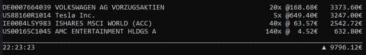

# TradeRepublic-Overview

## Why was this made ?

Currently there is no web/desktop app for Trade Republic, meaning it's pretty hard to follow your depot without your phone. With this application
it's really convenient to watch your depot grow while working on your computer.

## What does it do ?

There are two options to read in your depot, one is to specify a folder with all your pdf you exported out of Trade Republic. It then automatically
parses them for their ISINs and quantity. Other option is to specify a .csv file where you can explicitly state your positions. After the positions are read
it periodically displays your positions with their current price and total worth.

This is what the output will look like:

## How do I use it ?
Install via `pip install traderep`

Run the script with `-h` or `--help` to get following message:

    usage: traderep [-h] [--folder FOLDER] [--csv CSV]

    optional arguments:
    -h, --help       show this help message and exit
    --folder FOLDER  Specify folder you want to parse the pdfs in
    --csv CSV        Specify the .csv file you want to use

## What does the .csv file have to look like?

Example:

    ISIN;QUANTITY;PRICE;
    IE00B4L5Y983;50.0;62.28
    ...
